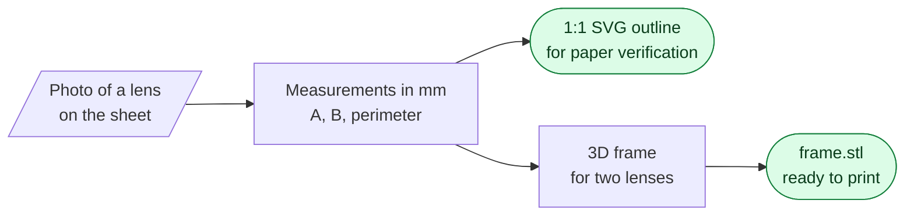
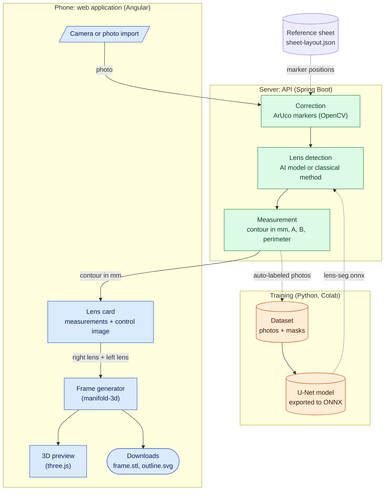

# OptiFrame YCrunch

From recycled eyeglass lenses to a 3D-printed frame. CodeML 2026 Challenge, Santé Numérique Sans Frontières.

- **Application:** https://optiframe.app
- **Target accuracy:** 0.5 mm for A, B, and the bridge, according to ISO 12870. The jury awards maximum points at 1 mm. See [Validation](docs/validation.md).



### Architecture

Three parts: the **application** on the phone, the **server** that performs the measurements, and the **AI model training**, which is done once in advance.



Blue: on the phone. Green: on the server. Orange: prepared in advance. Cylinders represent files or data.

| Folder      | Contents                                        |
| ----------- | ----------------------------------------------- |
| `frontend/` | Angular 22 application (PWA)                    |
| `backend/`  | Spring Boot 4 API, `POST /api/measure`          |
| `training/` | Reference sheet, dataset, training, ONNX export |

### Documentation

| Page                                   | Contents                                                          |
| -------------------------------------- | ----------------------------------------------------------------- |
| [How it works](docs/fonctionnement.md) | User workflow, photo checks, control images                       |
| [Frame](docs/monture.md)               | Frame generation, keeping the lens inside the circle, conventions |
| [Capture](docs/capture.md)             | Reference sheet, lighting, photography                            |
| [Data and AI](docs/donnees-ia.md)      | Auto-labeled collection, training, tools, and licenses            |
| [Validation](docs/validation.md)       | Measured deviations, known limitations, and mitigations           |
| [Deployment](docs/deploiement.md)      | Cloud Run, Cloud Build, environment variables                     |

### Run locally

```bash
# API (Java 25+)
cd backend && ./mvnw spring-boot:run          # http://localhost:8080

# App (Node 22.22+, 24.15+ or 26+)
cd frontend && npm install && npm start       # http://localhost:4200

# Reference sheet
cd training && pip install -r requirements.txt && python make_sheet.py

# Test on a phone (the camera requires HTTPS)
cloudflared tunnel --url http://localhost:4200
```

Tests: `cd backend && ./mvnw test` (end-to-end measurement on a synthetic tilted photo) and `cd frontend && npm test`.

### Formatting and continuous integration

| Code                                        | Tool                       | Fix                                                      |
| ------------------------------------------- | -------------------------- | -------------------------------------------------------- |
| TypeScript, HTML, CSS, JSON, YAML, Markdown | Prettier, ESLint (Angular) | `cd frontend && npm run format && npm run lint -- --fix` |
| Java, `pom.xml`                             | Spotless (Eclipse)         | `cd backend && ./mvnw spotless:apply`                    |
| Python                                      | Ruff                       | `ruff format . && ruff check --fix .`                    |
| Shell                                       | shfmt                      | `shfmt -w deploy/*.sh .githooks/*`                       |

- Running `npm install` in `frontend/` activates the `.githooks/pre-commit` hook: staged files are formatted before each commit (Ruff and shfmt must be installed for Python and shell files).
- GitHub Actions ([`ci.yml`](.github/workflows/ci.yml)) checks formatting, linting, tests, and the build on every push and pull request. Deployment remains handled by Cloud Build on `main`.

## License

[MIT](LICENSE). The libraries used retain their own licenses; see [Data and AI](docs/donnees-ia.md).
