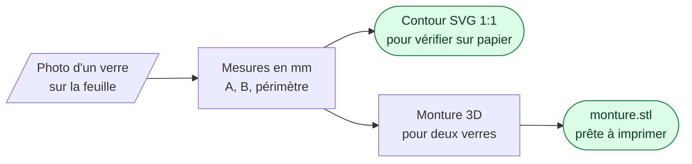
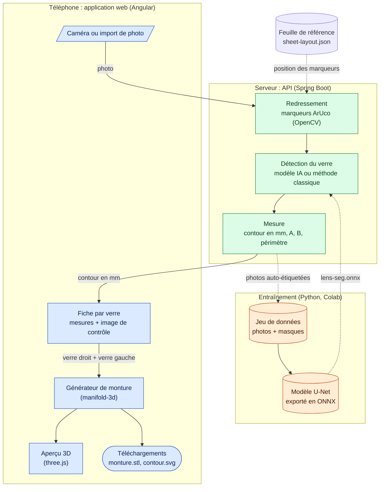

# OptiFrame YCrunch

Du verre de lunettes recyclé à la monture imprimée en 3D. Défi CodeML 2026, Santé Numérique Sans Frontières.

- **Application :** https://optiframe.app
- **Précision visée :** 0,5 mm sur A, B et le pont, selon la norme ISO 12870 (le jury accorde le maximum à 1 mm). Voir [Validation](docs/validation.md).



### Architecture

Trois parties : l'**application** sur le téléphone, le **serveur** qui mesure, et l'**entraînement** du modèle d'IA, fait une seule fois à l'avance.



Bleu : sur le téléphone. Vert : sur le serveur. Orange : préparé à l'avance. Les cylindres sont des fichiers ou des données.

| Dossier | Contenu |
|---|---|
| `frontend/` | Application Angular 22 (PWA) |
| `backend/` | API Spring Boot 4, `POST /api/measure` |
| `training/` | Feuille de référence, jeu de données, entraînement, export ONNX |

### Documentation

| Page | Contenu |
|---|---|
| [Fonctionnement](docs/fonctionnement.md) | Parcours de l'utilisateur, contrôles de la photo, images de contrôle |
| [Monture](docs/monture.md) | Génération de la monture, tenue du verre dans le cercle, conventions |
| [Capture](docs/capture.md) | Feuille de référence, éclairage, prise de vue |
| [Données et IA](docs/donnees-ia.md) | Collecte auto-étiquetée, entraînement, outils et licences |
| [Validation](docs/validation.md) | Écarts mesurés, limites connues et parades |
| [Déploiement](docs/deploiement.md) | Cloud Run, Cloud Build, variables d'environnement |

### Lancer en local

```bash
# API (Java 25+)
cd backend && ./mvnw spring-boot:run          # http://localhost:8080

# App (Node 22.22+, 24.15+ ou 26+)
cd frontend && npm install && npm start       # http://localhost:4200

# Feuille de référence
cd training && pip install -r requirements.txt && python make_sheet.py

# Tester sur un téléphone (la caméra exige HTTPS)
cloudflared tunnel --url http://localhost:4200
```

Tests : `cd backend && ./mvnw test` (mesure de bout en bout sur une photo synthétique inclinée) et `cd frontend && npm test`.
