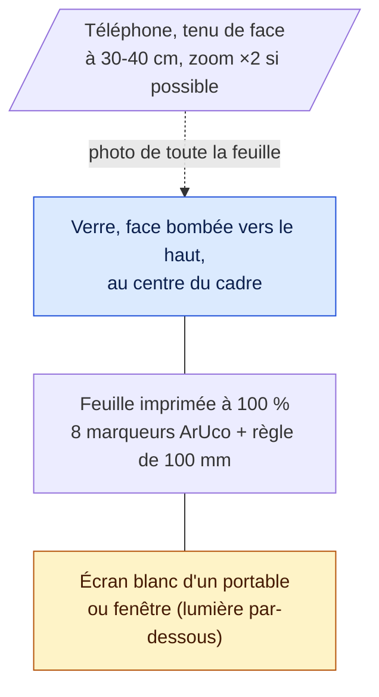

# Dispositif de capture

1. Imprimer `frontend/public/feuille-optiframe.pdf` **à 100 %** et vérifier la règle de 100 mm au pied à coulisse.
2. Poser la feuille sur l'écran blanc d'un portable (luminosité maximale) ou contre une fenêtre.
3. Poser le verre au centre du cadre, horizontal entre les repères.
4. Photographier toute la feuille, de face.

La disposition de la feuille est définie une seule fois dans `backend/src/main/resources/sheet-layout.json`. Le serveur et `training/make_sheet.py` lisent ce même fichier, donc la feuille imprimée et le détecteur restent toujours d'accord.

[← Retour au README](../README.md)
