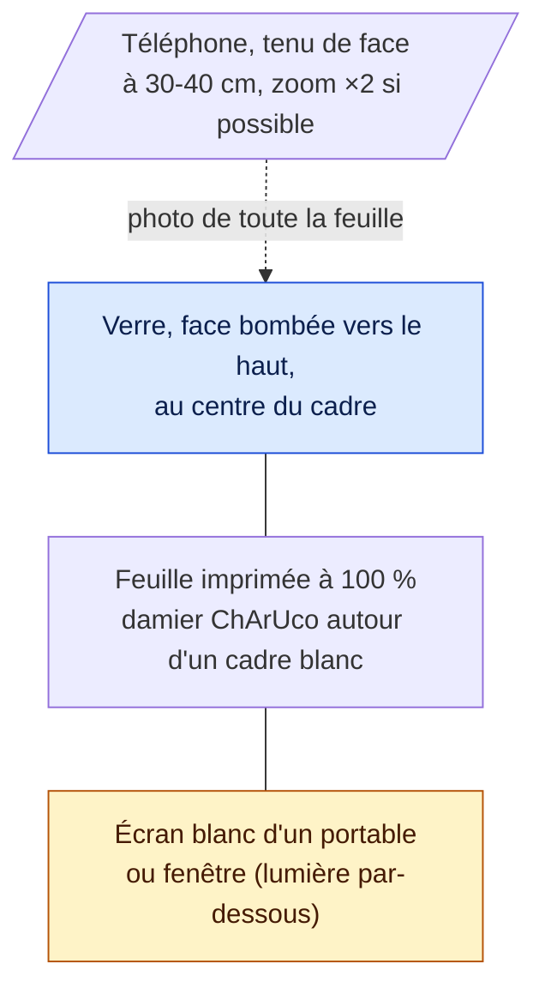

# Dispositif de capture

1. Imprimer `frontend/public/feuille-charuco-letter.pdf` (ou `-a4.pdf`) **à 100 %**, sans « ajuster à la page », et vérifier au pied à coulisse que 10 cases mesurent 150 mm.
2. Poser la feuille sur l'écran blanc d'un portable (luminosité maximale) ou contre une fenêtre.
3. Poser le verre au centre du cadre blanc, **bien droit, aligné sur les repères horizontaux** : A et B sont mesurés selon les axes de la feuille, un verre tourné de quelques degrés donne des valeurs trop grandes (jusqu'à +2,5 mm mesuré sur nos photos).
4. Photographier toute la feuille, de face.

Si l'imprimante réduit la feuille malgré le réglage 100 % (la nôtre l'imprime à 97,87 % : 10 cases = 146,8 mm), régler `OPTIFRAME_PRINT_SCALE` = longueur mesurée de 10 cases ÷ 150 (ici 0,9787) ; sinon toutes les mesures sont trop grandes du même pourcentage.

Le damier (12 × 17 cases de 15 mm, `DICT_5X5_250`) est identique sur Letter et A4 : les positions sont en mm du damier, le serveur n'a pas besoin de connaître le format du papier. Ses coins sont détectés au sous-pixel (jusqu'à 68 points hors du cadre, contre 32 pour l'ancienne feuille à 8 marqueurs), même si une partie du damier sort de la photo.

N'utiliser que la feuille à cadre blanc pour mesurer : les variantes Ronchi (`feuille-charuco-ronchi-*`, `feuille-ronchi-*`) servent à estimer la puissance du verre, leurs rayures empêchent la détection du contour.

La disposition est définie une seule fois dans `backend/src/main/resources/sheet-layout-charuco.json`, lue par le serveur et par `training/make_charuco_sheet.py`, donc la feuille imprimée et le détecteur restent toujours d'accord. L'ancienne feuille A4 à 8 marqueurs ArUco (`sheet-layout.json`, `training/make_sheet.py`) reste disponible avec `OPTIFRAME_SHEET_LAYOUT=sheet-layout.json`.

[← Retour au README](../README.md)
