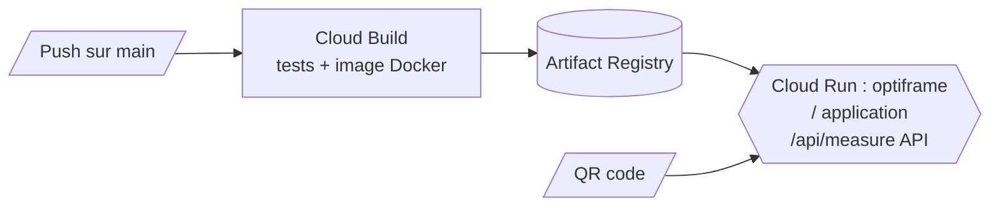

# Déploiement

Un seul service Cloud Run : Spring Boot sert l'API et l'application Angular à la même adresse.



Mise en place, une seule fois :

1. `PROJECT_ID=<projet> ./deploy/setup-gcp.sh` (APIs, dépôt Artifact Registry, rôles de Cloud Build).
2. Console GCP, Cloud Build > Déclencheurs : connecter le dépôt GitHub, déclencheur sur `^main$` avec `cloudbuild.yaml`.
3. Premier déploiement sans attendre un push : `gcloud builds submit --config cloudbuild.yaml --substitutions=SHORT_SHA=manual .`

#### Taille du service

Le nombre d'instances et les ressources sont des substitutions de `cloudbuild.yaml`, appliquées à chaque déploiement. Pour changer de mode, modifier ces valeurs et pousser.

| Mode | `_MIN_INSTANCES` | `_MAX_INSTANCES` | Effet |
|---|---|---|---|
| Hackathon | `1` | `3` | Pas de démarrage à froid, facturé même sans trafic |
| Après | `0` | `1` | Gratuit au repos, premier appel plus lent |

Pour appliquer tout de suite, sans reconstruire l'image (reporter aussi les valeurs dans `cloudbuild.yaml`, sinon le prochain push les remet) :

```bash
gcloud run services update optiframe --region=northamerica-northeast1 --min-instances=0 --max-instances=1
```

#### Domaines

`optiframe.app` est l'adresse principale ; `optiframe.ca` et `optiframe.net` y redirigent (301). Les trois zones sont sur Cloudflare et pointent vers le Worker `optiframe-proxy` (`deploy/worker/`), qui relaie les requêtes vers l'adresse Cloud Run, `https://optiframe-6vimt6bvrq-nn.a.run.app`. Si cette adresse change, mettre à jour `ORIGIN` dans `wrangler.jsonc` puis :

```bash
cd deploy/worker && npx wrangler deploy
```

| Variable | Où | Rôle |
|---|---|---|
| `_REGION` | substitution Cloud Build | Région |
| `_MIN_INSTANCES`, `_MAX_INSTANCES`, `_CONCURRENCY`, `_CPU`, `_MEMORY` | substitutions Cloud Build | Taille du service Cloud Run |
| `_API_URL` | substitution Cloud Build | URL de l'API si elle est séparée (vide : même adresse) |
| `PRIMARY_HOST`, `ORIGIN` | `deploy/worker/wrangler.jsonc` | Domaine principal, adresse Cloud Run relayée |
| `OPTIFRAME_CORS_ORIGINS` | Cloud Run | Origines autorisées si l'app est servie ailleurs |
| `OPTIFRAME_MODEL_PATH` | Cloud Run | Chemin du modèle ONNX |
