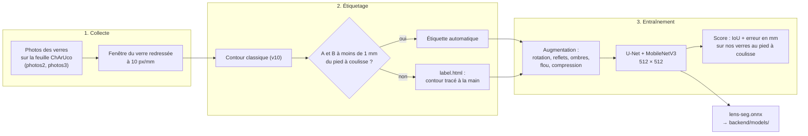
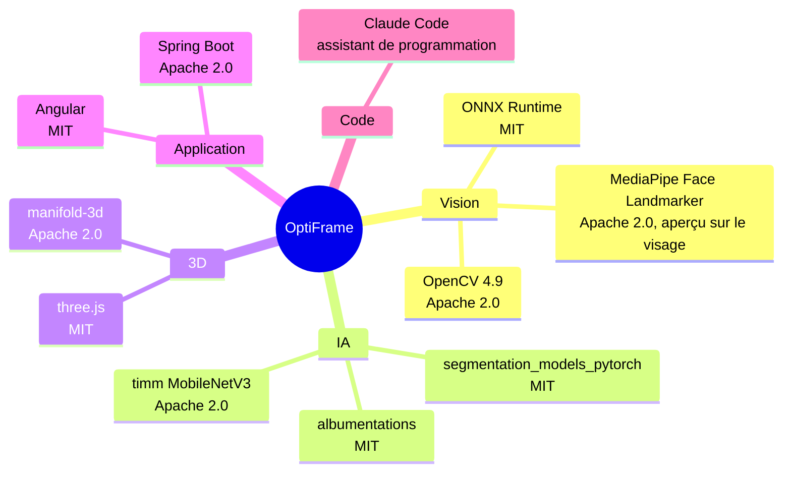

# Données et IA

Le modèle apprend à détourer le verre sur la fenêtre de la feuille ChArUco redressée. Les réponses (masques) viennent de la **méthode classique vérifiée au pied à coulisse** : un contour n'est gardé comme étiquette que s'il donne A et B à moins de 1 mm de la mesure réelle. Les autres fenêtres s'étiquettent à la main.

### Jeu de données

- **3 verres** mesurés au pied à coulisse (boxing A × B) : `lens1` 49,5 × 30,5 mm, `lens2` 51,4 × 38,4 mm, `red` (teinté) 55,7 × 46,5 mm.
- **77 fenêtres redressées** tirées des photos de `lensDetection/photos2/` et `photos3/` (Git LFS). La feuille a été imprimée à 97,87 % ; l'échelle est corrigée avant l'étiquetage.
- **10 photos exclues**, parce que l'app les refuserait : sans rétroéclairage (3), flou de bougé (4), feuille coupée (2), prise trop inclinée (1). La liste et les raisons sont dans `make_dataset.py`.
- **Jeu d'entraînement : 24 fenêtres**, soit 23 étiquettes automatiques et 1 étiquette à la main (11 `lens1`, 10 `lens2`, 3 `red`). Validation : 1/5 des fenêtres tiré au hasard (graine fixe).
- Les fenêtres sur motif Ronchi ne sont pas étiquetées : la méthode classique ne sait pas les détourer.
- La cible de départ (~200 paires) est abandonnée pour le défi (#5). Les outils restent prêts pour une prochaine collecte.

Outils, à lancer depuis `lensDetection/` :

- `dataset/make_dataset.py` redresse chaque photo utilisable, garde les étiquettes automatiques et prépare la file à étiqueter.
- `dataset/label.html` sert à tracer le contour à la main. Si le détecteur de feuille échoue, on y clique aussi les 4 coins de la fenêtre.
- `dataset/finalize.py` produit `results_dataset/train/` et compare chaque étiquette tracée à la main avec le pied à coulisse.
- Les fenêtres et les masques (`results_dataset/`) ne sont pas versionnés : on les régénère à partir des photos.

### Entraînement

- `training/train.py` : U-Net, encodeur `timm-mobilenetv3_large_100` pré-entraîné ImageNet, AdamW (lr 1e-3, cosinus), 40 époques. Le meilleur modèle selon l'IoU de validation est exporté en ONNX.
- Augmentation (`training/dataset.py`) : retournements, rotation ±20°, échelle ±10 %, luminosité et contraste, ombres, reflets (_sun flare_), flou, compression JPEG.
- Le prétraitement (512 × 512, normalisation ImageNet) est identique dans `training/dataset.py` et `OnnxSegmenter.java`.
- Le modèle (`backend/models/lens-seg.onnx`, 27 Mo) est versionné, pour que chaque déploiement le contienne. `method=auto` l'utilise quand il est présent et repasse à la méthode classique sinon.

### Résultats

| Mesure                                                                   | Méthode classique | Modèle      |
| ------------------------------------------------------------------------ | ----------------- | ----------- |
| IoU de validation                                                        | —                 | **0,977**   |
| Erreur moyenne sur A et B (44 photos au pied à coulisse, `/api/measure`) | 1,05 mm           | **0,64 mm** |
| Photos avec A et B à moins de 1 mm (sur 41 mesurées)                     | 19                | **29**      |
| Erreur moyenne, photos absentes de l'entraînement                        | 1,55 mm           | **0,87 mm** |

- La validation ne compte que 4 fenêtres, sur les 3 mêmes verres : l'IoU est optimiste. L'erreur en mm sur les photos jamais vues est le chiffre le plus honnête.
- Le critère du défi (≤ 1 mm d'erreur moyenne sur A et B) est atteint sur nos 3 verres. Il reste à vérifier sur d'autres verres, en particulier les verres très clairs et les verres montés dans une monture.
- Comparaison sur les prises difficiles (reflets, sans rétroéclairage) : pas encore faite.

### Pistes essayées

- **Segment Anything (SAM 2.1 tiny)**, sans entraînement : avec une boîte autour du verre, IoU 0,96 à 0,98, mais les points et le mode automatique échouent. Il faudrait l'amorcer avec la boîte de la méthode classique, puisque le défi interdit les indications manuelles. Ni intégré ni déployé. Détails : [`lensDetection/approaches.md`](../lensDetection/approaches.md).
- **Jeux de données publics** : aucun ne correspond à notre cas (un verre détouré seul sur une feuille). Trans10K, ClearGrasp et TransProteus ont été examinés, avec leurs licences, dans `approaches.md` → « Dataset search ». Aucun n'est utilisé.
- **Images de synthèse** : prévues (#7), pas encore générées.

### Collecte en continu et vie privée

- Lancer l'API avec `OPTIFRAME_DATASET_DIR=<dossier>`. Chaque mesure réussie y enregistre la fenêtre redressée et son masque.
- Aucune donnée personnelle : seulement des verres sur une feuille, ni visage ni ordonnance. L'aperçu sur le visage (MediaPipe) tourne dans le navigateur, et l'image ne quitte jamais le téléphone.

## Outils et licences

[← Retour au README](../README.md)
