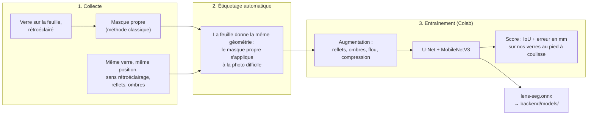
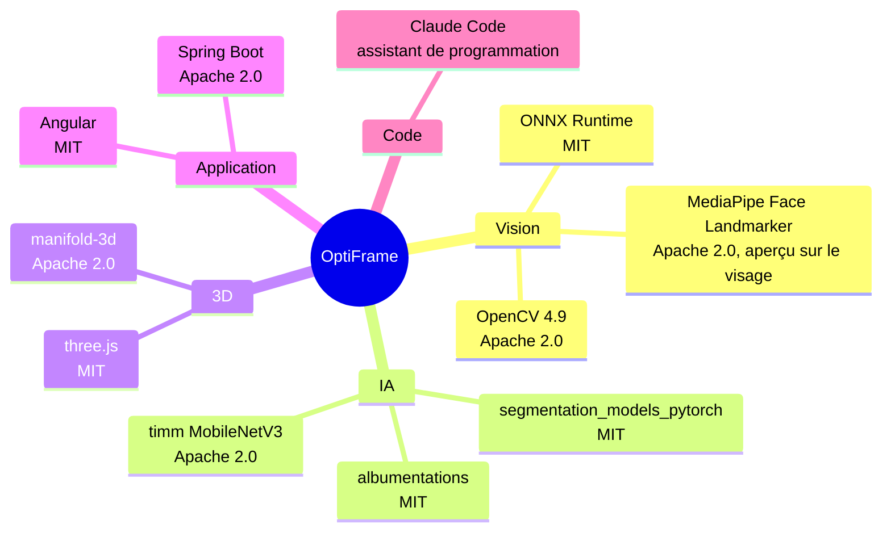

# Données et IA

Le rétroéclairage rend le verre facile à détourer. On s'en sert pour **fabriquer automatiquement les réponses** qui entraînent le modèle à se débrouiller sans rétroéclairage.

> À compléter pendant le défi : nombre d'images, verres utilisés, IoU, erreur en mm.

- Collecte : lancer l'API avec `OPTIFRAME_DATASET_DIR=<dossier>`. Chaque mesure réussie y enregistre le cadre redressé et son masque.
- Entraînement : `training/train.py`. Le prétraitement (512 × 512, normalisation ImageNet) est identique dans `training/dataset.py` et `OnnxSegmenter.java`.
- Aucune donnée personnelle : seulement des verres sur une feuille, pas de visages ni d'ordonnances.

## Outils et licences

[← Retour au README](../README.md)
