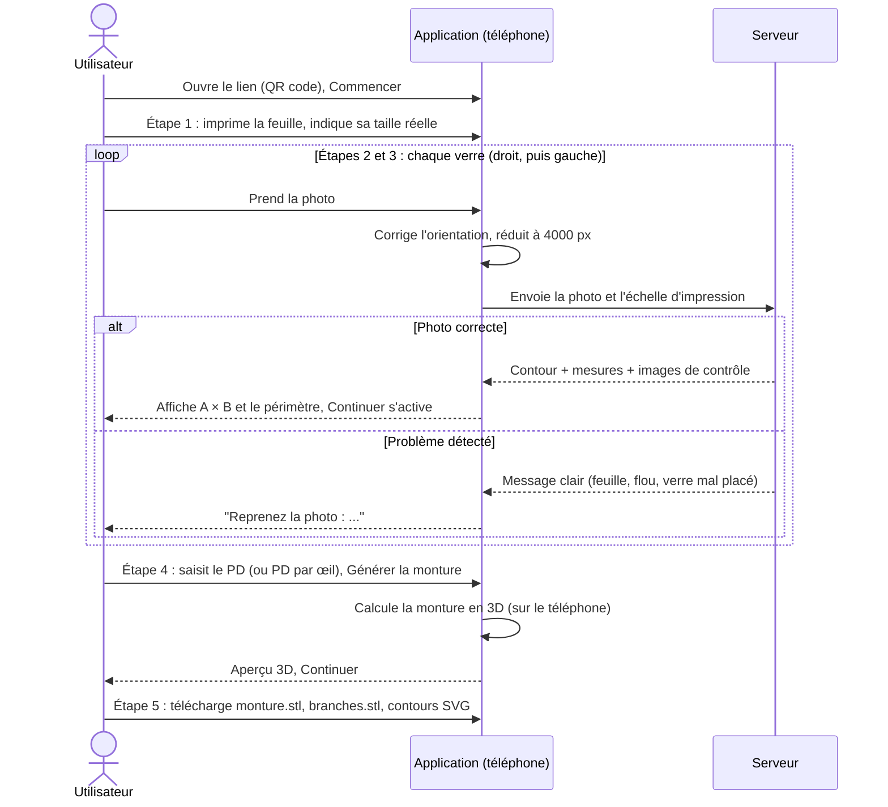
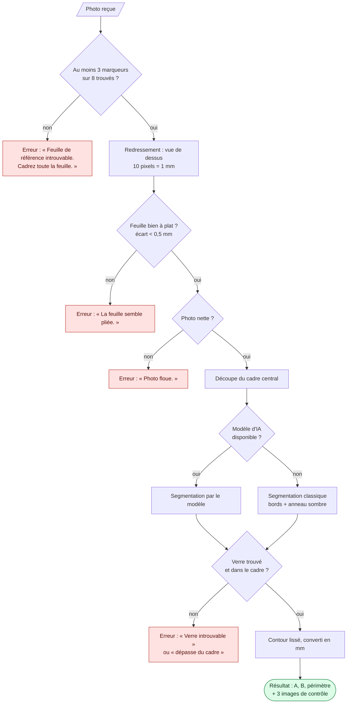
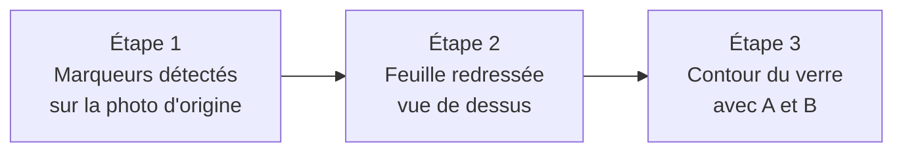

# Fonctionnement

## Parcours de l'utilisateur

L'app guide l'utilisateur en cinq étapes, une à la fois. L'accueil les présente comme les lignes d'un tableau d'acuité. En haut de l'écran, l'échelle des étapes (1 à 5) montre l'étape en cours, soulignée en rouge, et coche en vert celles qui sont terminées. Le bouton **Continuer**, en bas, reste désactivé tant que l'étape n'a pas son résultat, avec une phrase qui dit ce qui manque.

| Étape                | Ce que fait l'utilisateur                                                                                        | Pour continuer                              |
| -------------------- | ---------------------------------------------------------------------------------------------------------------- | ------------------------------------------- |
| 1. Feuille           | Choisit Letter ou A4, télécharge la feuille, indique la longueur mesurée de 10 cases (ou l'échelle d'impression) | Une taille d'impression valide (80 à 120 %) |
| 2. Verre droit (OD)  | Prend la photo ou l'importe ; peut en prendre une 2e pour vérifier la stabilité                                  | Le verre droit mesuré                       |
| 3. Verre gauche (OG) | Même chose avec le verre gauche                                                                                  | Le verre gauche mesuré                      |
| 4. Monture           | Saisit le PD (total ou par œil), puis **Générer la monture** depuis la barre du bas                              | La monture générée                          |
| 5. Fichiers          | Télécharge `monture.stl`, `branches.stl` et `contours-paire.svg`                                                 | —                                           |

Depuis l'étape **Fichiers**, trois vérifications facultatives :

- **Vérification : verres et monture** : contour mesuré superposé au cercle de la monture, écart en mm tout autour.
- **Aperçu sur le visage** : monture à taille réelle sur la caméra frontale ou un selfie, analysée sur le téléphone. Le PD estimé peut remplacer celui saisi ; l'app renvoie alors à l'étape Monture pour régénérer.
- **Processus de mesure** : pour chaque verre, ce que le programme a fait, étape par étape (voir plus bas).

L'app suit le thème clair ou sombre du système, ou celui choisi avec le bouton en haut à droite. Elle existe en français, anglais et espagnol. Le thème, la langue et les réglages de la feuille sont gardés sur le téléphone.

## Comment une photo devient une mesure

Chaque contrôle peut arrêter le traitement avec un message clair qui dit quoi corriger, dans la langue de l'app.

Les trois images de contrôle, visibles dans la page **Processus de mesure** de l'app (étape Fichiers), avec le nombre de marqueurs trouvés, l'écart d'ajustement en mm, la résolution en px/mm, la méthode de segmentation et la durée :

[← Retour au README](../README.md)
