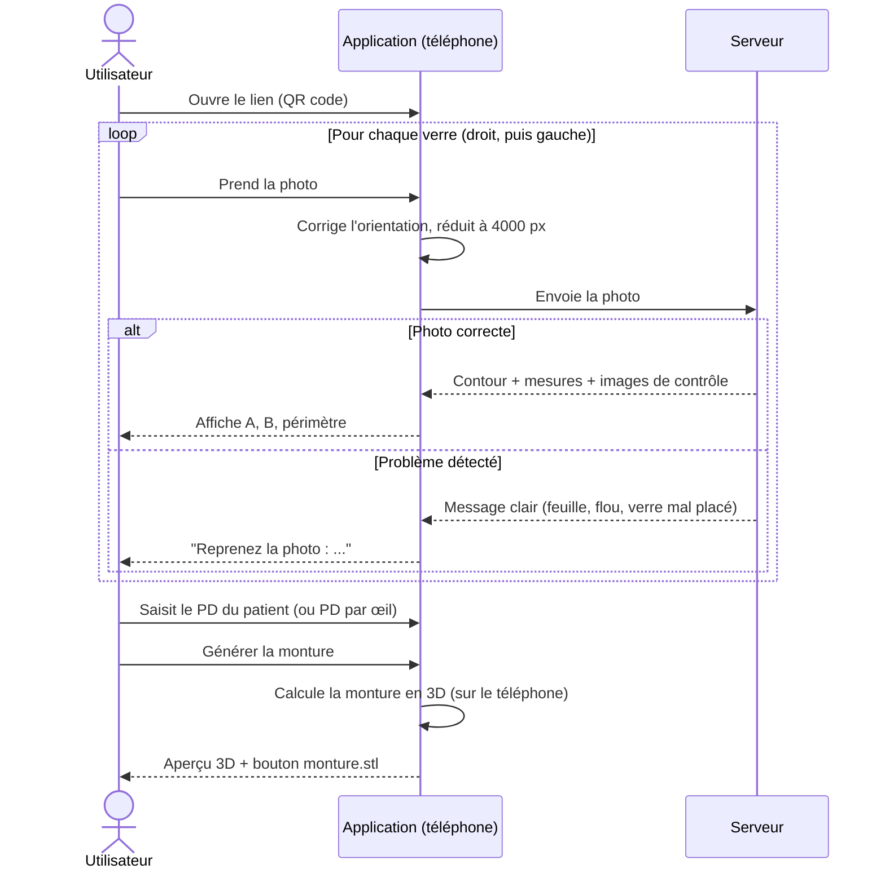
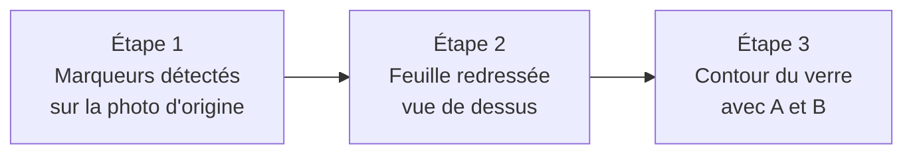

# Fonctionnement

## Parcours de l'utilisateur

## Comment une photo devient une mesure

Chaque contrôle peut arrêter le traitement avec un message en français qui dit quoi corriger.

Les trois images de contrôle, visibles dans la page **Pas à pas** de l'app :

[← Retour au README](../README.md)
