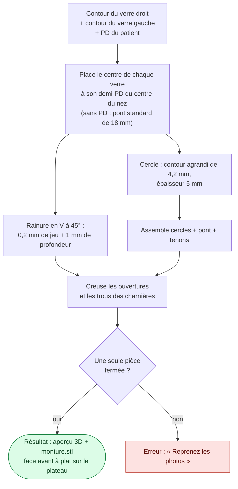
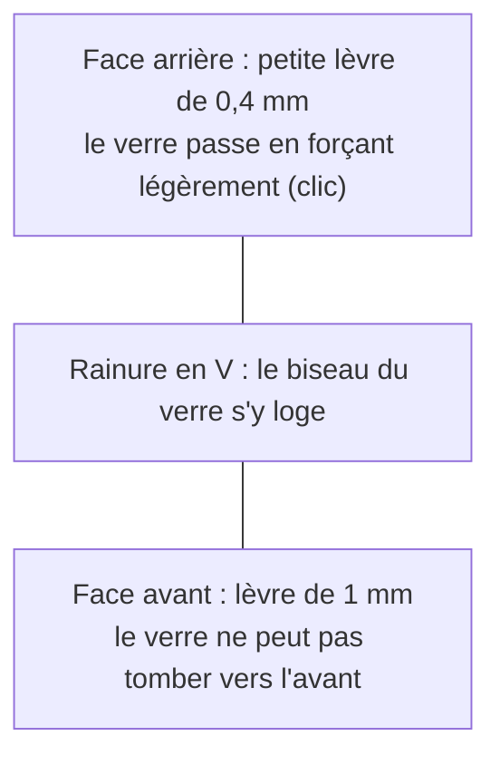
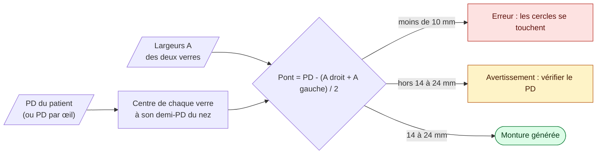

# La monture

## Comment la monture est fabriquée

Comment le verre tient dans le cercle (coupe du cercle, face avant en bas) :

## Placement des verres : le PD du patient

Les verres recyclés vont à un nouveau patient : l'écart de l'ancienne monture ne compte pas. Le centre optique de chaque verre doit tomber devant la pupille, donc on place les verres à partir du PD (écart pupillaire) du patient, et le pont en découle.

Sans PD saisi, l'app utilise un pont standard de 18 mm. Le centre optique est supposé au centre du rectangle boxing ; un verre décentré déplace l'effet prismatique (règle de Prentice : prisme = décentrement en cm × puissance).

**Convention :** les contours sont vus de face, face bombée vers le haut. Le verre droit (OD) est à gauche quand on regarde la monture de face, le côté nasal vers le centre. Le contrat partagé est `LensContour` (`frontend/src/app/core/lens.ts`, `backend/.../api/dto/LensContour.java`).

[← Retour au README](../README.md)
