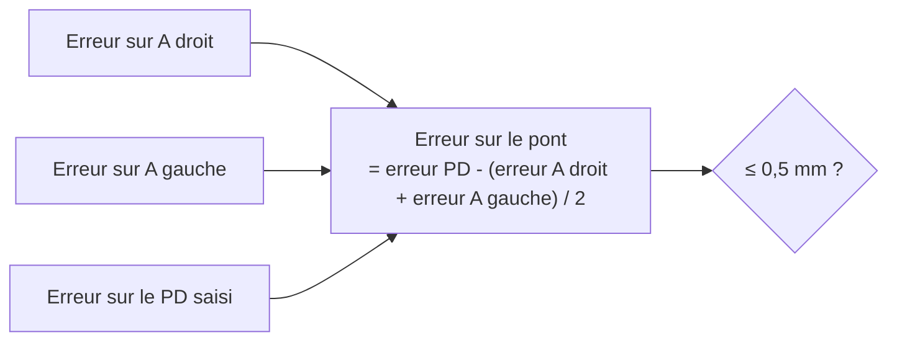
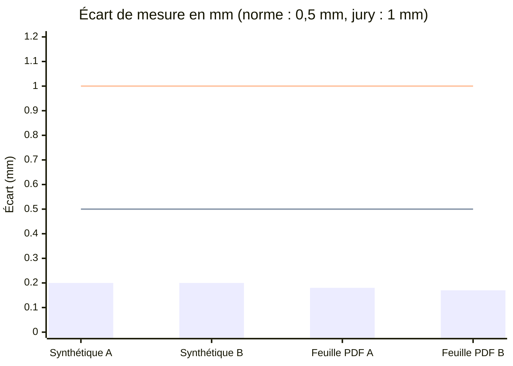
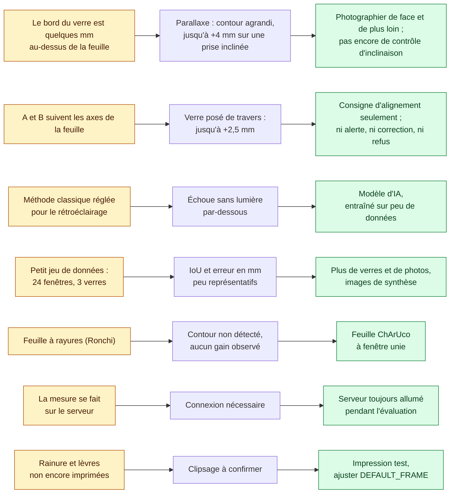

# Validation et limites

## Objectif de précision

| Seuil      | Source                                                 | Porte sur                                             |
| ---------- | ------------------------------------------------------ | ----------------------------------------------------- |
| **0,5 mm** | Norme ISO 12870 (montures de lunettes)                 | Largeur A, hauteur B et écart entre les verres (pont) |
| 1 mm       | Grille du jury (30 points si l'écart moyen est ≤ 1 mm) | A et B                                                |

Notre objectif est le seuil de la norme : **0,5 mm**. Une monture qui respecte 1 mm suffit pour le jury, mais 0,5 mm est ce qu'il faut pour qu'elle soit utilisable par un patient.

Le pont est calculé à partir du PD et des largeurs A : la moitié de l'erreur de chaque verre s'y retrouve. Bien mesurer A compte donc deux fois.

## Résultats

Écart entre la mesure et la vraie taille, avec la norme (0,5 mm) et la grille du jury (1 mm) :

| Test                                                                          | Vraie taille   | Mesuré                                                        |
| ----------------------------------------------------------------------------- | -------------- | ------------------------------------------------------------- |
| Photo synthétique inclinée (`MeasurementServiceTest`)                         | 50,0 × 36,0 mm | 50,2 × 36,2 mm                                                |
| Feuille PDF rastérisée à 300 dpi, déformée en perspective                     | 52,0 × 37,9 mm | 52,2 × 38,1 mm                                                |
| Monture STL à partir de deux vraies photos (`lens1` + `lens2`, voir plus bas) | 1 pièce fermée | 1 pièce étanche, chaque arête partagée par exactement 2 faces |

Les mesures sont toutes environ 0,2 mm trop grandes : ce biais constant se corrige avec `optiframe.edge-bias-mm` (réglé à −0,1 mm, voir plus bas). Sur de vrais verres, l'épaisseur du bord peut ajouter 0,3 à 0,5 mm : sans calibration, on dépasserait la norme.

### Photos réelles (verre teinté rouge, feuille ChArUco Letter rétroéclairée)

Même verre sur 5 photos originales (Galaxy S22 Ultra, `lensDetection/photos2/`) prises à la main, cadre blanc, méthode classique, via `/api/measure` (4 octobre) :

| Photo  | A (mm) | B (mm) | Remarque                                                              |
| ------ | ------ | ------ | --------------------------------------------------------------------- |
| 212010 | 46,43  | 56,90  |                                                                       |
| 212014 | 47,80  | 57,30  |                                                                       |
| 212017 | 47,03  | 57,70  |                                                                       |
| 212021 | 48,20  | 61,36  | prise très inclinée : la face supérieure du verre s'ajoute au contour |
| 212023 | 48,32  | 57,21  |                                                                       |

- Redressement : 37 à 58 marqueurs, écart d'ajustement 0,17 à 0,29 mm. 3 photos sur 14 refusées avec un message clair (2 trop inclinées, 1 feuille sans marqueurs).
- Dispersion : 2 mm sur A, 0,8 mm sur B (hors prise inclinée). Le prototype par couleur donne 46,56 ± 0,79 × 56,63 ± 0,47 mm sur 11 photos.
- Corrigé en cours de route : l'ombre du verre était prise pour le verre (jusqu'à +4 mm). Seuils relevés dans `ClassicalSegmenter`, test de non-régression ajouté.
- Détail des essais, prototypes et recommandations : [`lensDetection/approaches.md`](../lensDetection/approaches.md).

### Comparaison au pied à coulisse

Valeurs au pied à coulisse : `lens1` 49,5 × 30,5 mm, `lens2` 51,4 × 38,4 mm, verre rouge 55,7 × 46,5 mm. La feuille utilisée pour ces photos était imprimée à 97,87 % (5 cases = 73,4 mm au lieu de 75,0) : les mesures sont ramenées à la vraie échelle de la feuille. Méthode classique (contour polaire lissé), via `/api/measure`, cadre blanc :

| Verre     | Photos | Médiane mesurée (mm) | Pied à coulisse (mm) | Erreur moyenne absolue       | Photos à ≤ 1 mm sur A et B |
| --------- | ------ | -------------------- | -------------------- | ---------------------------- | -------------------------- |
| `lens1`   | 19     | 49,09 × 30,76        | 49,5 × 30,5          | 0,73 mm                      | 12 / 19                    |
| `lens2`   | 16     | 50,94 × 38,46        | 51,4 × 38,4          | 1,02 mm                      | 9 / 16                     |
| rouge     | 5      | 55,70 × 46,62        | 55,7 × 46,5          | 0,67 mm                      | 3 / 5                      |
| **Total** | **40** |                      |                      | **0,84 mm** (biais +0,02 mm) | **24 / 40**                |

- Méthode classique sans biais : les erreurs restantes viennent de la prise de vue (verre tourné sur la feuille, prise très inclinée, double bord éclairé de côté), pas d'un décalage systématique.
- Calibration de `edge-bias-mm` (4 octobre, mêmes photos, A et B comparés au plus long et au plus court côté) : le modèle, utilisé par défaut, mesure +0,25 mm trop grand, la méthode classique +0,02 mm. Le réglage est commun aux deux méthodes ; on le règle pour le modèle à **−0,1 mm** (le contour est rétréci de 0,1 mm, A et B de 0,2 mm).

| Méthode   | Photos | `edge-bias-mm` 0 : erreur moyenne (biais) | −0,1 mm : erreur moyenne (biais) | Photos à ≤ 1 mm (0 → −0,1) |
| --------- | ------ | ----------------------------------------- | -------------------------------- | -------------------------- |
| Modèle    | 45     | 0,80 mm (+0,25)                           | **0,77 mm (+0,05)**              | 28 → 29                    |
| Classique | 41     | 0,82 mm (+0,02)                           | 0,85 mm (−0,17)                  | 25 → 22                    |

- Le modèle a été entraîné sur une partie de ces photos : le gain est à confirmer sur une nouvelle série, feuille imprimée à 100 %.
- Sur une feuille imprimée à 97,87 %, toutes les mesures sont 2,2 % trop grandes : vérifier que 10 cases mesurent 150 mm avant chaque démonstration.

### Photos réelles (deux verres transparents, `lensDetection/photos3/`)

119 photos (Galaxy S22 Ultra) de deux verres transparents de formes différentes, sur les trois feuilles Letter, avec ou sans éclairage par-dessous, de face et inclinées (3 à 28°), zoom 1× et 1,58×. Méthode classique (contour polaire), via `/api/measure`. Dimensions du rectangle minimal (indépendantes de la rotation du verre) :

| Verre                       | Photos mesurées (cadre blanc) | Longueur (mm) | Largeur (mm) |
| --------------------------- | ----------------------------- | ------------- | ------------ |
| `lens1` (rectangle arrondi) | 19                            | 50,26 ± 0,96  | 31,05 ± 0,85 |
| `lens2` (plus rond)         | 16                            | 51,29 ± 0,57  | 38,21 ± 0,52 |

- 35 photos sur 47 avec cadre blanc sont mesurées (11 avant le contour polaire) ; les 12 autres sont refusées avec un message clair (8 feuilles non détectées, 4 verres non trouvés).
- Les dispersions incluent les prises inclinées et zoomées ; ce sont des écarts de répétabilité, pas des écarts à la vraie taille.
- Les feuilles à rayures (Ronchi) ne permettent pas de détecter le contour.

### Monture STL

Monture générée par l'application à partir de deux vraies photos (`lens1` à droite, `lens2` à gauche, feuille ChArUco Letter), STL téléchargé puis vérifié avec `trimesh`. Les coins identiques du STL sont fusionnés, comme le fait un trancheur ; un maillage fermé valide a chaque arête partagée par exactement 2 faces.

| Version                                                       | Triangles  | Taille      | Pièces | Étanche | Arêtes partagées par plus de 2 faces | Faces d'aire nulle |
| ------------------------------------------------------------- | ---------- | ----------- | ------ | ------- | ------------------------------------ | ------------------ |
| Rainure en tranches de 0,25 mm (avant le 4 octobre)           | 97 990     | 4,7 Mo      | 27     | non     | 3 177                                | 4 510              |
| Fond plat de la rainure en une seule découpe (`ef03479`)      | 84 604     | 4,1 Mo      | 1      | oui     | 2 747                                | 3 804              |
| **Rainure en une seule découpe lissée (`7a6a368`, en ligne)** | **19 674** | **0,96 Mo** | **1**  | **oui** | **0**                                | **0**              |

- Même volume dans les trois versions (6,75 cm³) : seule la qualité du maillage change, pas la forme.
- Corrections : la rainure en V est un seul solide aux parois à 45° (prolongées de 0,1 mm au-delà des faces) au lieu d'une pile de tranches ; cercles, pont et avant des charnières sont extrudés en une seule forme ; la monture est simplifiée à 1 µm près pour retirer les triangles minuscules laissés par les opérations booléennes.
- Vérifié aussi sur https://optiframe.app (4 octobre) : même résultat, 0 défaut.
- Encombrement 100 × 60 × 11 mm, posé sur la face avant ; rainure et lèvres pas encore imprimées (voir limites).

> À compléter : nouvelle série de photos sur une feuille imprimée à 100 %.

## Limites connues

- **Verre tourné sur la feuille** : A et B sont mesurés le long des axes de la feuille. Un verre posé de travers donne d'autres valeurs (jusqu'à +2,5 mm). L'app demande d'aligner le verre sur les repères, mais elle ne détecte pas la rotation : pas d'alerte, pas de correction automatique, pas de refus. Le rectangle minimal (`rotatedAMm`, `rotatedBMm`) est déjà calculé par le serveur, mais il n'est pas utilisé (#8).
- **Parallaxe** : le bord du verre est quelques millimètres au-dessus de la feuille, donc il paraît plus grand sur la photo, et encore plus sur une prise inclinée (61,4 mm au lieu d'environ 57 mm sur B pour la photo 212021). Les prises trop inclinées pour que la feuille soit redressée sont refusées. Sinon, l'inclinaison n'est ni mesurée ni signalée.
- **Feuille Ronchi** : les rayures n'ont pas aidé. La méthode classique ne trouve pas le contour du verre sur ces feuilles, et nous n'avons pas pu les étiqueter pour le modèle. Les PDF restent dans `training/sheets/`, mais l'app utilise la feuille ChArUco à fenêtre unie.
- **Données d'entraînement** : 24 fenêtres de 3 verres seulement. L'IoU de validation (0,977) est calculée sur 4 fenêtres des mêmes verres, et l'erreur en mm (0,64 mm, 0,87 mm sur les photos jamais vues) sur ces 3 verres. Ces chiffres doivent encore être confirmés sur d'autres verres, surtout les verres très clairs. Détails : [`donnees-ia.md`](donnees-ia.md).

[← Retour au README](../README.md)
