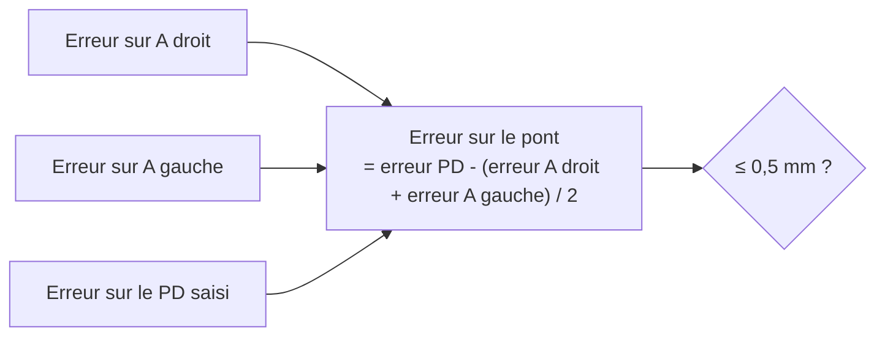
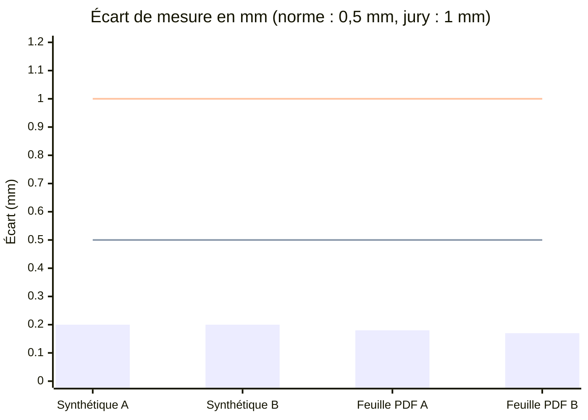
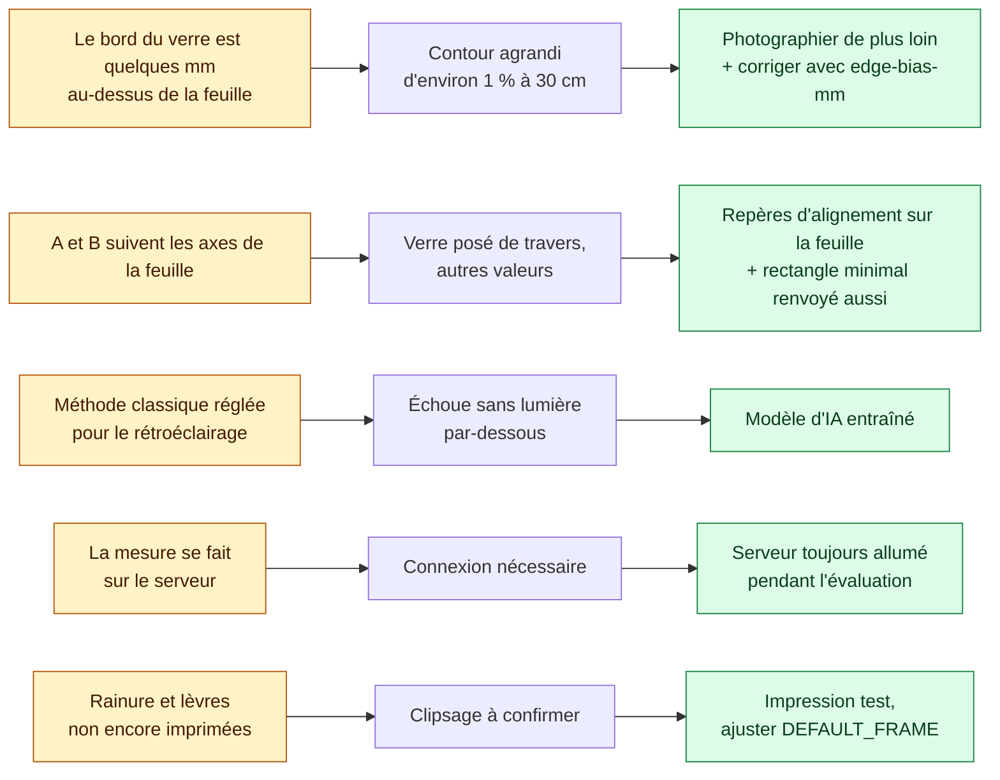

# Validation et limites

## Objectif de précision

| Seuil | Source | Porte sur |
|---|---|---|
| **0,5 mm** | Norme ISO 12870 (montures de lunettes) | Largeur A, hauteur B et écart entre les verres (pont) |
| 1 mm | Grille du jury (30 points si l'écart moyen est ≤ 1 mm) | A et B |

Notre objectif est le seuil de la norme : **0,5 mm**. Une monture qui respecte 1 mm suffit pour le jury, mais 0,5 mm est ce qu'il faut pour qu'elle soit utilisable par un patient.

Le pont est calculé à partir du PD et des largeurs A : la moitié de l'erreur de chaque verre s'y retrouve. Bien mesurer A compte donc deux fois.

## Résultats

Écart entre la mesure et la vraie taille, avec la norme (0,5 mm) et la grille du jury (1 mm) :

| Test | Vraie taille | Mesuré |
|---|---|---|
| Photo synthétique inclinée (`MeasurementServiceTest`) | 50,0 × 36,0 mm | 50,2 × 36,2 mm |
| Feuille PDF rastérisée à 300 dpi, déformée en perspective | 52,0 × 37,9 mm | 52,2 × 38,1 mm |
| Monture STL, deux verres différents (50 × 36 et 46 × 40) | 1 pièce fermée, 4 trous | 1 pièce, 0 défaut de maillage, 4 trous |

Les mesures sont toutes environ 0,2 mm trop grandes : ce biais constant se corrige avec `optiframe.edge-bias-mm`. Sur de vrais verres, l'épaisseur du bord peut ajouter 0,3 à 0,5 mm : sans calibration, on dépasserait la norme.

### Photos réelles (verre teinté rouge, feuille ChArUco Letter rétroéclairée)

Même verre sur 5 photos originales (Galaxy S22 Ultra, `lensDetection/photos2/`) prises à la main, cadre blanc, méthode classique, via `/api/measure` (4 octobre) :

| Photo | A (mm) | B (mm) | Remarque |
|---|---|---|---|
| 212010 | 46,43 | 56,90 | |
| 212014 | 47,80 | 57,30 | |
| 212017 | 47,03 | 57,70 | |
| 212021 | 48,20 | 61,36 | prise très inclinée : la face supérieure du verre s'ajoute au contour |
| 212023 | 48,32 | 57,21 | |

- Redressement : 37 à 58 marqueurs, écart d'ajustement 0,17 à 0,29 mm. 3 photos sur 14 refusées avec un message clair (2 trop inclinées, 1 feuille sans marqueurs).
- Dispersion : 2 mm sur A, 0,8 mm sur B (hors prise inclinée). Le prototype par couleur donne 46,56 ± 0,79 × 56,63 ± 0,47 mm sur 11 photos.
- Corrigé en cours de route : l'ombre du verre était prise pour le verre (jusqu'à +4 mm). Seuils relevés dans `ClassicalSegmenter`, test de non-régression ajouté.
- Détail des essais, prototypes et recommandations : [`lensDetection/approaches.md`](../lensDetection/approaches.md).

### Photos réelles (deux verres transparents, `lensDetection/photos3/`)

119 photos (Galaxy S22 Ultra) de deux verres transparents de formes différentes, sur les trois feuilles Letter, avec ou sans éclairage par-dessous, de face et inclinées (3 à 28°), zoom 1× et 1,58×. Méthode classique (contour polaire), via `/api/measure`. Dimensions du rectangle minimal (indépendantes de la rotation du verre) :

| Verre | Photos mesurées (cadre blanc) | Longueur (mm) | Largeur (mm) |
|---|---|---|---|
| `lens1` (rectangle arrondi) | 19 | 50,26 ± 0,96 | 31,05 ± 0,85 |
| `lens2` (plus rond) | 16 | 51,29 ± 0,57 | 38,21 ± 0,52 |

- 35 photos sur 47 avec cadre blanc sont mesurées (11 avant le contour polaire) ; les 12 autres sont refusées avec un message clair (8 feuilles non détectées, 4 verres non trouvés).
- Les dispersions incluent les prises inclinées et zoomées ; ce sont des écarts de répétabilité, pas des écarts à la vraie taille.
- Les feuilles à rayures (Ronchi) ne permettent pas de détecter le contour.

> À compléter : valeurs au pied à coulisse des trois verres (pour calibrer `edge-bias-mm`), contrôle de l'inclinaison de la photo.

## Limites connues

[← Retour au README](../README.md)
