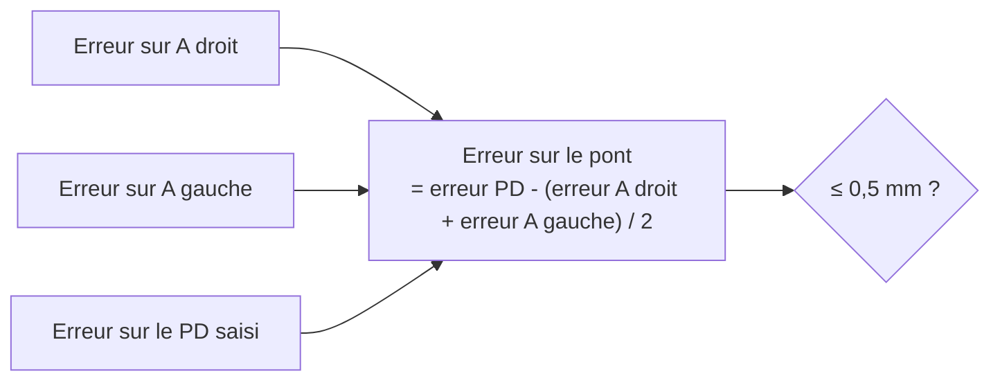
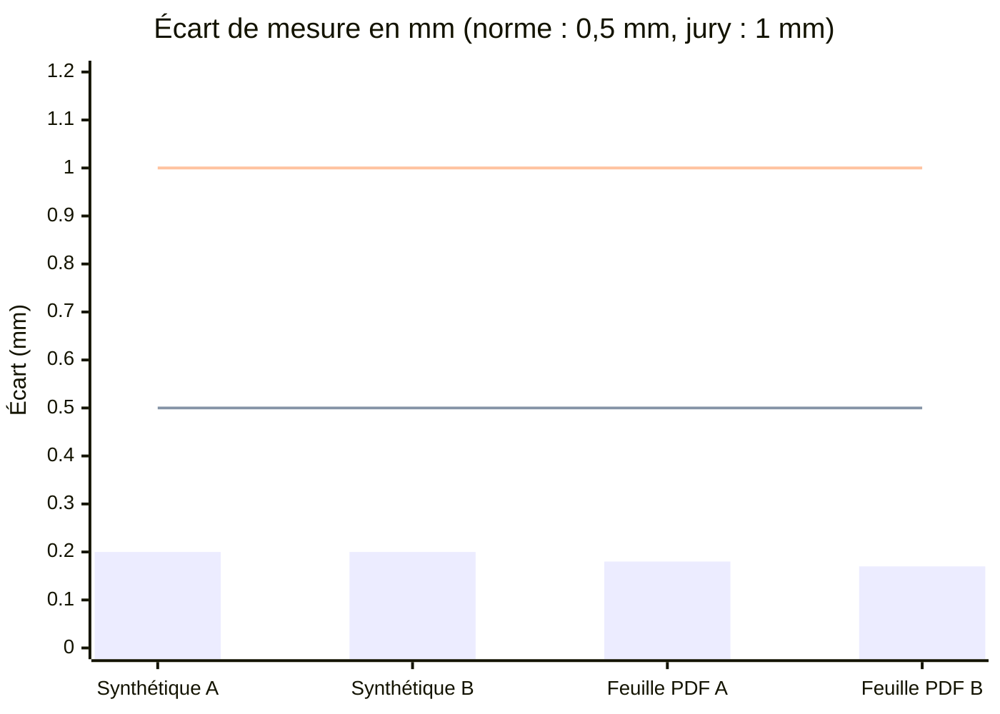
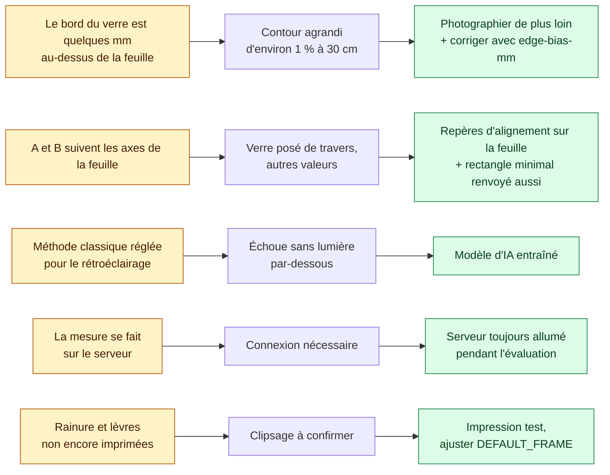

# Validation et limites

## Objectif de précision

| Seuil | Source | Porte sur |
|---|---|---|
| **0,5 mm** | Norme ISO 12870 (montures de lunettes) | Largeur A, hauteur B et écart entre les verres (pont) |
| 1 mm | Grille du jury (30 points si l'écart moyen est ≤ 1 mm) | A et B |

Notre objectif est le seuil de la norme : **0,5 mm**. Une monture qui respecte 1 mm suffit pour le jury, mais 0,5 mm est ce qu'il faut pour qu'elle soit utilisable par un patient.

Le pont est calculé à partir du PD et des largeurs A : la moitié de l'erreur de chaque verre s'y retrouve. Bien mesurer A compte donc deux fois.

## Résultats

Écart entre la mesure et la vraie taille, avec la norme (0,5 mm) et la grille du jury (1 mm) :

| Test | Vraie taille | Mesuré |
|---|---|---|
| Photo synthétique inclinée (`MeasurementServiceTest`) | 50,0 × 36,0 mm | 50,2 × 36,2 mm |
| Feuille PDF rastérisée à 300 dpi, déformée en perspective | 52,0 × 37,9 mm | 52,2 × 38,1 mm |
| Monture STL, deux verres différents (50 × 36 et 46 × 40) | 1 pièce fermée, 4 trous | 1 pièce, 0 défaut de maillage, 4 trous |

Les mesures sont toutes environ 0,2 mm trop grandes : ce biais constant se corrige avec `optiframe.edge-bias-mm`. Sur de vrais verres, l'épaisseur du bord peut ajouter 0,3 à 0,5 mm : sans calibration, on dépasserait la norme.

> À compléter : verres réels mesurés au pied à coulisse, plusieurs prises par verre, avant et après calibration de `edge-bias-mm`.

## Limites connues

[← Retour au README](../README.md)
